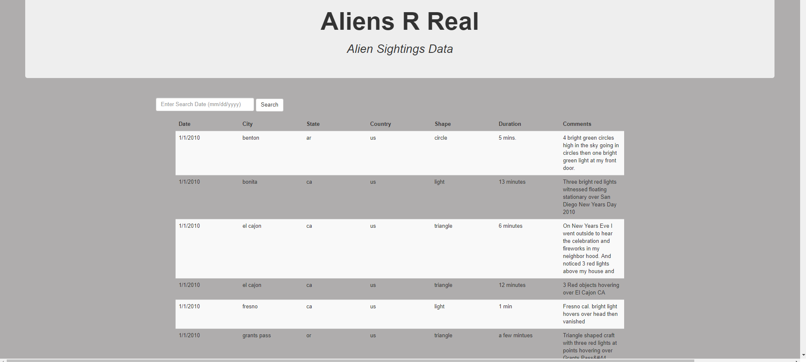

### Aliens R Real

Wrote code that will create a table dynamically based upon an "UFO SIghtings" dataset [UFO Sightings Data](data.js) that allows users to search through the table for specific pieces of information. 

### Automatic Table and Date Search

* Created a basic HTML web page.

* Using the ufo dataset provided in the form of a JavaScript object, wrote code that appends a table to the web page and then adds new rows of data for each UFO sighting.

Languages and Tools:
- Javascript
- HTML
- CSS

